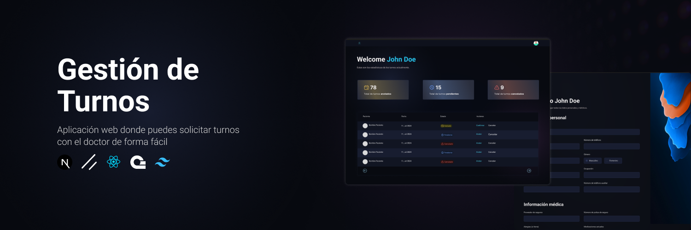

<div align="center">
<h1>DocHeal</h1>
<br />
  <a href="" target="_blank">
    
  </a>
</div>

DocHeal es un Sistema de gestión de turnos para los pacientes, donde pueden registrarse, agendar turnos y administrarlos.

## 🧰 Tecnologías usadas

- ![Next.js][Next.js]
- ![React.js][React.js]
- ![ShadcnUI][ShadcnUI]
- ![TailwindCSS][TailwindCSS]
- ![Appwrite][Appwrite]
- ![ReactTable][ReactTable]
- ![ReactHookForm][ReactHookForm]
- ![TypeScript][TypeScript]

## 💡 Funcionalidades

- **Registro de pacientes**
- **Agendar turnos**
- **Administrar turnos**
- **Notificaciones de turnos**
- **Panel de administrador**

## 🪛 Preparando el proyecto

Para el back-end se utilizó [**Appwrite**](https://appwrite.io/) (un servicio de back-end en la nube). Se necesita crear una cuenta en dicha página, luego se necesita crear una base de datos, una colección para pacientes y una colección para turnos.

1. **Clonar el repositorio**:

```bash
git clone https://github.com/DocHeal/DocHeal.git
```

2. **Instalar las dependencias**: puedes usar npm o yarn para instalar las dependencias, el que más te guste, en este caso utilicé npm.

```bash
npm install
```

3. **Configurar las variables de entorno**: aquí es donde comenzamos con el back-end, utilizando Appwrite. Una vez creado la cuenta, habinedo generado una nueva base de datos, una colección para pacientes y una colección para turnos, necesitamos crear un archivo `.env` o `.env.local` en la raíz del proyecto.

```bash
# TD = turnos-doctor
# Appwrite
NEXT_PUBLIC_TD_ENDPOINT=https://cloud.appwrite.io/v1
PROJECT_ID=
TD_API_KEY=
TD_DATABASE_ID=
TD_PATIENT_COLLECTION_ID=
TD_APPOINTMENT_COLLECTION_ID=
TD_BUCKET_ID=

NEXT_PUBLIC_ADMIN_PASSKEY=123456
```

4. **Iniciar el servidor**: Una vez configurado el archivo `.env` o `.env.local`, ejecutamos `npm run start` o `yarn start` para iniciar el servidor.

```bash
npm run dev
```

[Next.js]: https://img.shields.io/badge/Next.js-000000?style=for-the-badge&logo=nextjs&logoColor=white
[React.js]: https://img.shields.io/badge/React-20232A?style=for-the-badge&logo=react&logoColor=61DAFB
[ShadcnUI]: https://img.shields.io/badge/shadcn/ui-000000?style=for-the-badge&logo=shadcn/ui&logoColor=white
[TailwindCSS]: https://img.shields.io/badge/TailwindCSS-38B2AC?style=for-the-badge&logo=tailwind-css&logoColor=white
[Appwrite]: https://img.shields.io/badge/Appwrite-000000?style=for-the-badge&logo=appwrite&logoColor=white
[ReactTable]: https://img.shields.io/badge/ReactTable-000000?style=for-the-badge&logo=reacttable&logoColor=white
[ReactHookForm]: https://img.shields.io/badge/ReactHookForm-000000?style=for-the-badge&logo=reacthookform&logoColor=white
[TypeScript]: https://img.shields.io/badge/TypeScript-007ACC?style=for-the-badge&logo=typescript&logoColor=white
[Zod]: https://img.shields.io/badge/Zod-000000?style=for-the-badge&logo=zod&logoColor=white

## 📞 Contacto

- 📧 [My Email](mailto:eliaspereyra_gomez@hotmail.com)
- 🔗 [GitHub](https://github.com/EliasPereyra)
